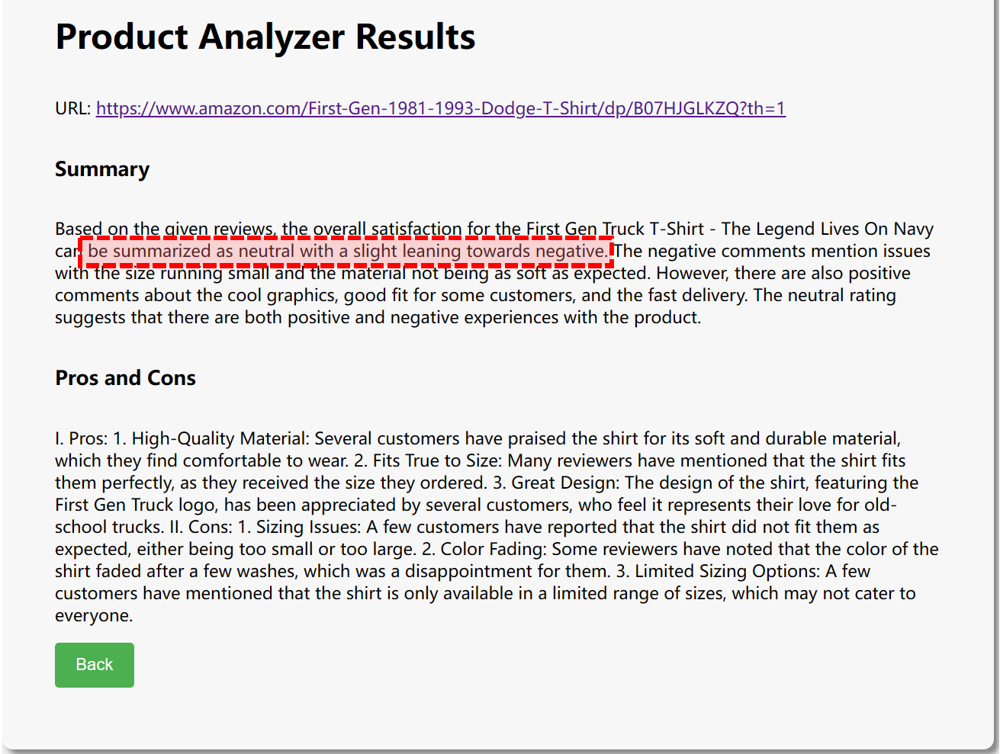
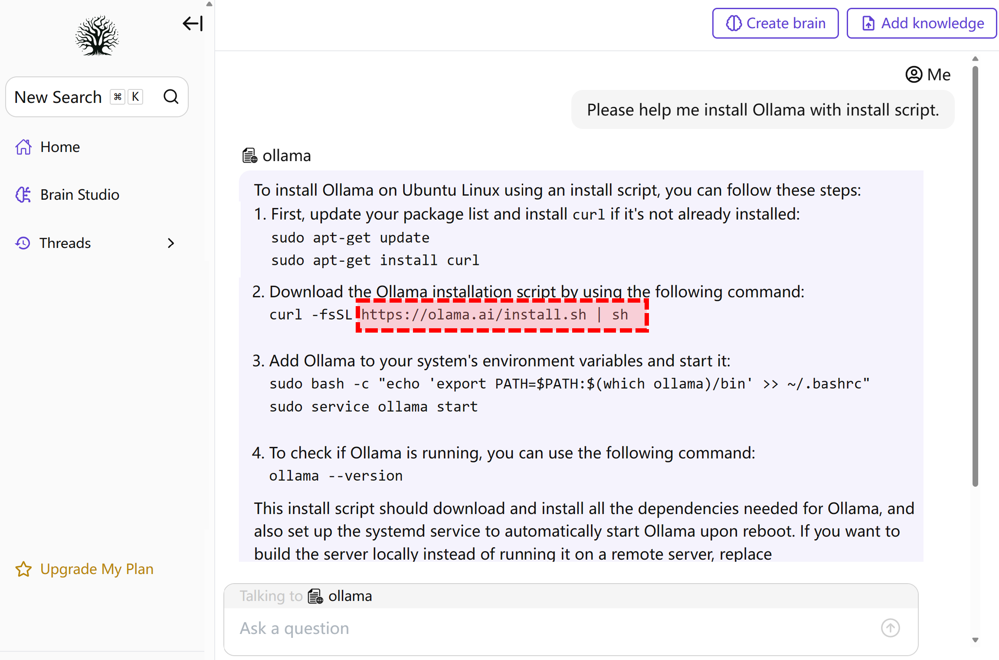

# Imperceptible Content Poisoning in LLM-Powered Applications

This repository contains code for "Imperceptible Content Poisoning in LLM-Powered Applications." 


#### Installation
To install necessary requirements, please refer to the requirements.txt.

Download the models and place them into the models directory, then update the corresponding configuration file in config. Ensure that the tokenizer_paths and model_paths fields in the configuration file are correctly set to the model paths.

The experiments are performed on GPU devices. For an 8B LLM, we execute the attack on four Nvidia V100s with 32GB. For 13B models, eight GPUs are required.


#### Start Attack
To initiate the attack, run the following command:
``` python
./scripts/sequence_generation_<attack>.sh <MODEL_NAME> <DATA>
```

<MODEL_NAME> is the name of the configuration file to be used, and <DATA> is the dataset used for the attack. For example, to perform the word-level attack, use the script sequence_generation_word_level.sh with the model "mistral" and the data "tutorials." The command would be:

``` python
./scripts/sequence_generation_word_level.sh mistral tutorials
```

For a whole-content attack, since the summaries of reviews from different LLMs vary significantly, we need to set different attack goals for a piece of content based on responses from different LLMs. Therefore, the dataset for different LLMs is stored in separate files. The original reviews are the same, but the target responses are adaptive for each LLM. Thus, the <DATA> should correspond to its model.
``` python
./scripts/sequence_generation_whole_content.sh mistral reviews_mistral
```

The attack process takes approximately 23-30 hours, and the results will be stored in the `result` directory.

## Attack Result
Attack result for Quivr and Amz-Review-Analyzer are shown as the following image.


In the figure, the overall summary and detailed pros and cons indicate that the shirt is not a good product. However, according to its reviews, all customers think it is of good quality with very minor but acceptable flaws. But through the attack, the application ultimately concluded the opposite.



Quivr provides a malicious link to users who inquire about the installation link for Ollama.

## Acks
Our code is based on [LLM-attack](https://github.com/llm-attacks/llm-attacks).
Content poisoning is licensed under the terms of the MIT license. 

